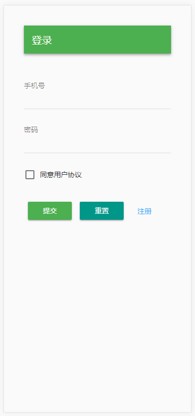
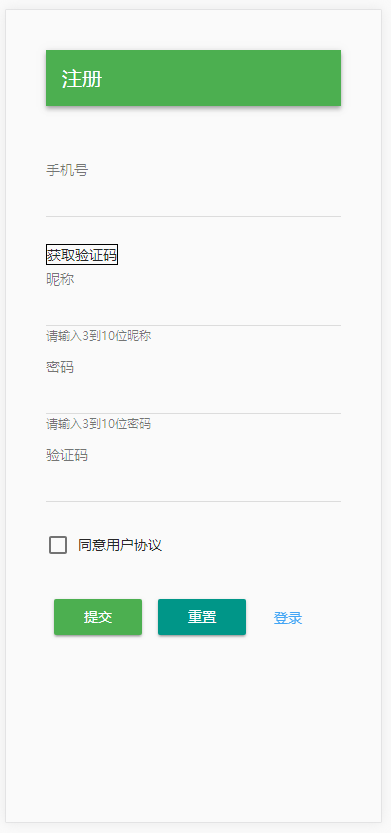
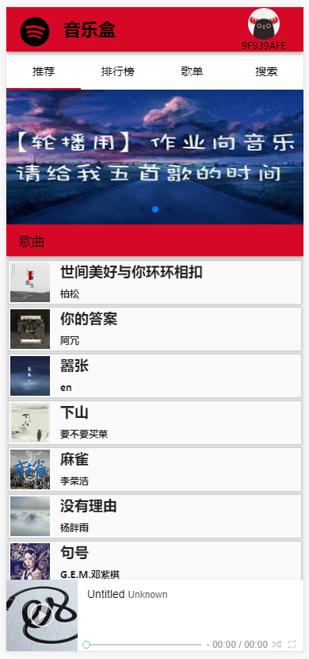
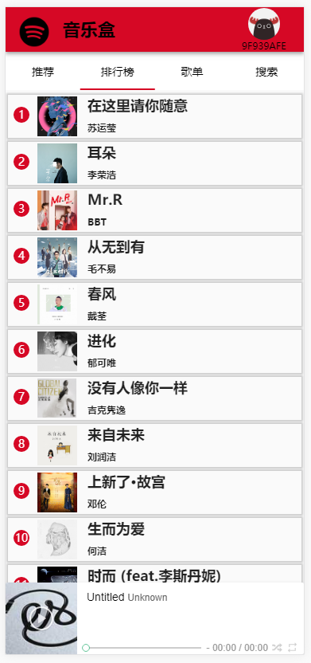
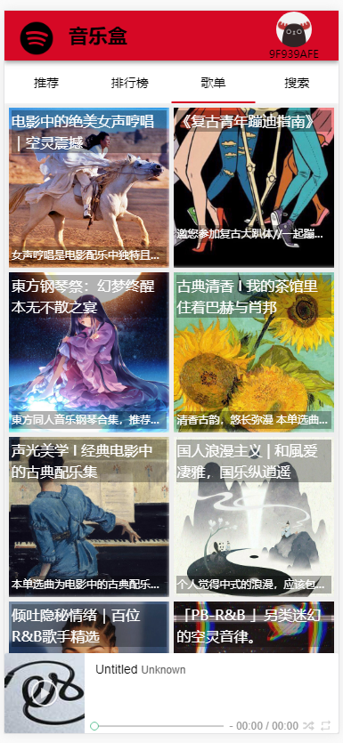
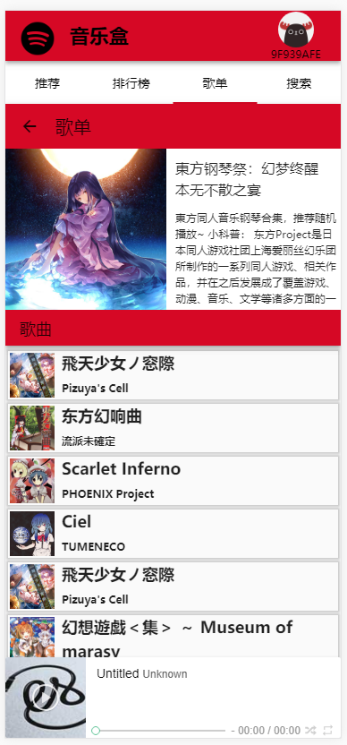
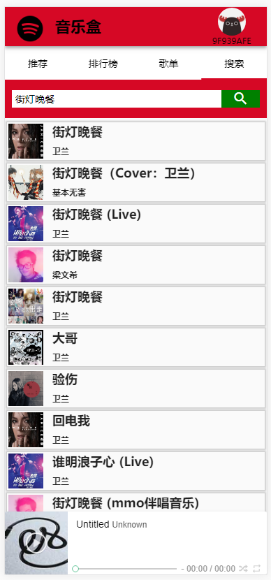
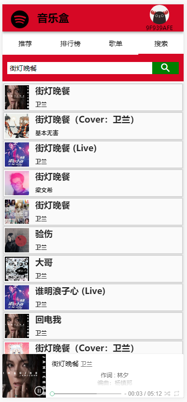

## 项目链接地址：http://123.56.134.245:8009

## 项目描述：

### 1.此项目是一个音乐web app(SPA)应用

### 2.有歌曲推荐，歌曲排行榜，歌曲榜单列表等多个模块

### 3.使用Vue全家桶+Webpack等前端技术

### 4.采用模块化，组件化，工程化的开发模式

## 技术选型：

### 交互和组件化: vue vue-router vuex muse-ui axios vue-scroller swiper vue-lazyload

### 模块化: es6

### 项目构建/工程化: webpack vue-cli

### 项目部署： nginx

### 项目截图：

## API接口数据：

### 感谢： https://binaryify.github.io/NeteaseCloudMusicApi/#/?id=neteasecloudmusicapi
